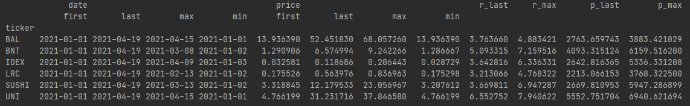
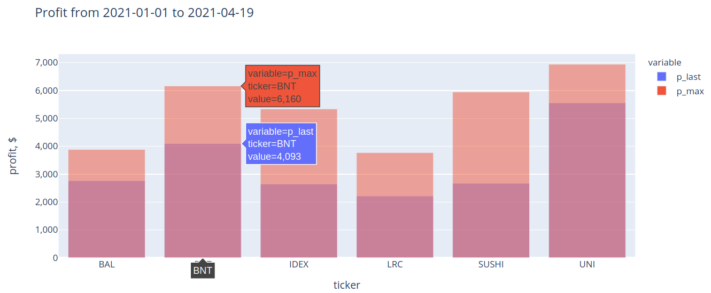

# Covalent API - get historical prices by ticker symbol

Related article: [Covalent API — how you can use it](https://coolex.medium.com/covalent-api-how-you-can-use-it-a4ba613d5f1e)

Example of the use of **Covalent API** - get historical prices by ticker symbol.

Links:

- [Covalent docs](https://www.covalenthq.com/docs/)
- [Covalent API docs](https://www.covalenthq.com/docs/api/#overview)
- [Sign up for a free API key](https://www.covalenthq.com/platform/#/auth/register)

Endpoint  used for example ([Get historical prices by ticker symbol](https://www.covalenthq.com/docs/api/#get-/v1/pricing/historical/{quote_currency}/{ticker_symbol}/))

```
https://api.covalenthq.com/v1/pricing/historical/{quote_currency}/{ticker_symbol}/
```





## Prerequisites

- python >= 3.9
- [Covalent API key](https://www.covalenthq.com/platform/#/auth/register)

## Installation

Clone repo and create `.env` file.

```
git clone https://github.com/erc30/covalent-api-example.git
cd covalent-api-example
cp .env.example .env
```

The project uses [poetry](https://github.com/python-poetry/poetry) as a dependency management tool. Poetry automatically creates venv and install all requirements to it.

If you have poetry, just run:

```bash
poetry install
```

Or you can manually create a virtual environment and install dependencies via pip:

```bash
python3.9 -m venv venv

source venv/bin/activate   # activate venv in linux bash
venv\Scripts\activate.bat  # activate venv in windows cmd

pip install -r requirements.txt
```

## Configuration

First add your **Covalent API key** to `.env` file.

Then in `main.py` replace following values with the desired ones.

- `TICKER_LIST` - list of **ERC20** tokens. For non ERC20 tokens endpoint  return error (maybe only yet?)
- `START_DATE` - start date of price range
- `END_DATE` - end date of price range
- `DEPOSIT` - the size of the deposit (USD) to find out how it has changed from start date to end date.

```python
TICKER_LIST = ["UNI", "SUSHI", "BAL", "LRC", "BNT", "IDEX"]
START_DATE = "2021-01-01"
END_DATE = "2021-04-19"
# USD deposit
DEPOSIT = 1000
```

## Usage

Activate shell with poetry:

```bash
poetry shell
```

Run script:

```bash
python main.py
```
